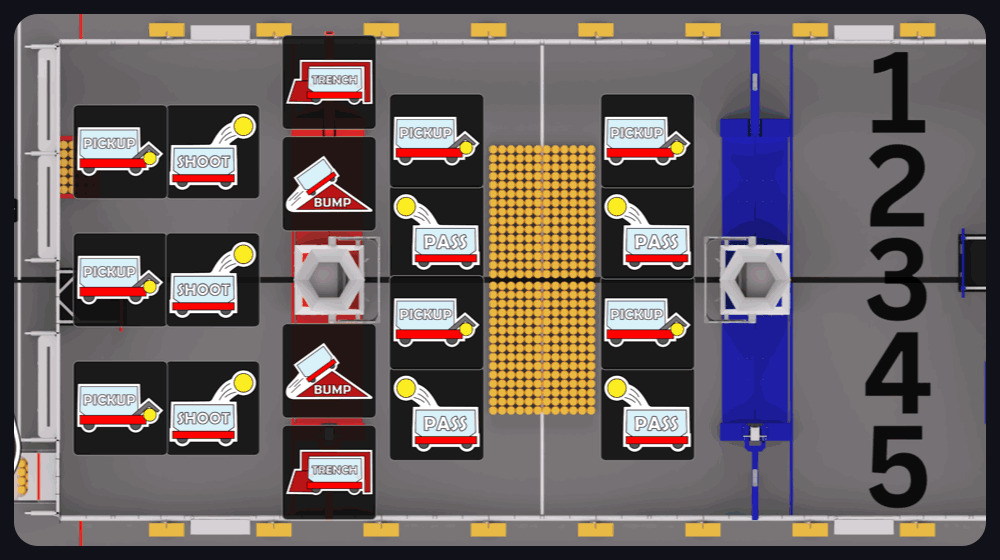

 

Hiya! I’m Sukhsimranpreet Chana, an incoming University of Waterloo Computer Science student interested in building random stuff haha...

My work currently revolves around:

- FMC - First Media Community
- Questionably useful hardware projects, including a 67 bot and a Disney XD wand simulator
- Robotics with FRC Team 2056

I enjoy experimenting, learning new technologies, and building things that are equal parts practical, creative, and slightly ridiculous. I love working with like-minded people!

For professional inquiries, collaborations, or project conversations:

  

